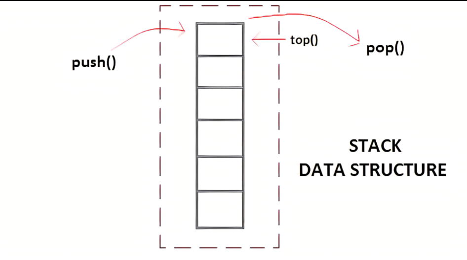
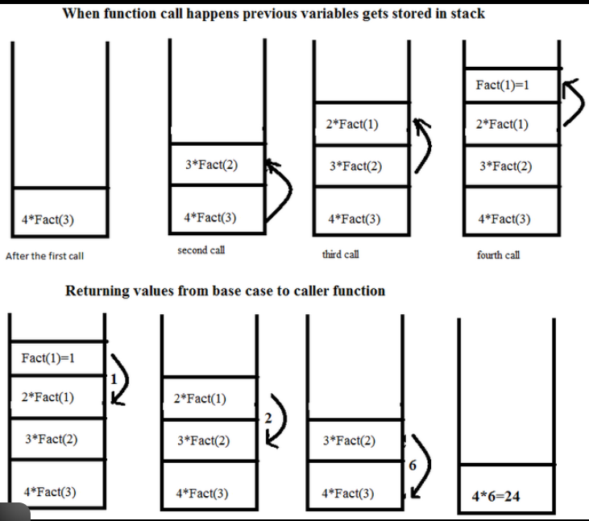

# 🧱 Java Stack Basics – Core Operations

> A beginner-friendly Java project that demonstrates fundamental Stack operations using the built-in java.util.Stack class.

### This project helps understand:
- How a stack works internally
- Core stack operations
- Reversing and copying stacks

## Real-world stack behavior

# 📌 What is a Stack?

> A Stack is a linear data structure that follows the:
LIFO Principle — Last In, First Out. This means the last element added is the first one removed.

- Real-Life Example
- Stack of plates
- Browser back button
- Undo/Redo operations

 -------------------------------------
# Stack Working (Visual Representation)

 -------------------------------------
### Explanation: 
- Elements are added using push()
- Elements are removed using pop()
- Only the top element is accessible

# ⚙️ Basic Stack Operations
Operation	Method	Description
Insert element	push()	Adds element to the top
Remove element	pop()	Removes top element
View top element	peek()	Shows top without removing
Check empty	isEmpty()	Returns true if empty
Stack size	size()	Returns number of elements

Operation       | Operation   | Description                       |
--------------- | ----------- | --------------------------------- |
`Insert Element`| `push()`    | Add element to top of stack       |
`Remove Element`| `pop()`     | Remove top element                |
`View Top Element`| `peek()`    | View top element without removing |
`Check Empty`   | `isEmpty()` | Check if stack is empty           |
`Stack Size`    | `size()`    | Get number of elements            |

# ⚠️ What is Stack Overflow?

> Stack Overflow occurs when: 
We try to push elements beyond the stack’s capacity.
The stack has a limited memory space. 
When that space is exceeded, a Stack Overflow error occurs.

> A StackOverflowError in Java is a runtime Error that occurs when the Java Virtual Machine (JVM) runs out of space in the call stack. The call stack stores information about active method calls, including method parameters, local variables, and the return address for each method.  
When too many method calls are nested without returning, the stack memory, which has a limited, fixed size, becomes exhausted. 

## Real Meaning in Java

In Java, stack overflow usually happens due to: 
- Infinite recursion (most common):  
When a function calls itself repeatedly without a stopping condition.

- Very deep method calls:   
Too many nested function calls fill the call stack.
- Large local variables:  Declaring very large local variables (e.g., a massive array) directly on the stack can consume a significant amount of stack space quickly. 

# Q1: What causes stack overflow in Java?
Answer:
- Infinite recursion
- Too many nested method calls

# Q2: How to prevent stack overflow?

Answer:
- Use proper base conditions
- Avoid unnecessary deep recursion
- Use iteration when possible