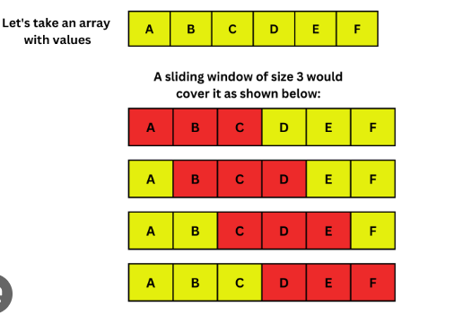

# Sliding Window Technique

> Sliding Window Technique is a method used to solve problems that involve subarray or substring or window.

> - Instead of repeatedly iterating over the same elements, the sliding window maintains a range (or “window”) that moves step-by-step through the data, updating results incrementally.
> - The main idea is to use the results of previous window to do computations for the next window.
> - Commonly used for problems like finding subarrays with a specific sum, finding the longest substring with unique characters, or solving problems that require a fixed-size window to process elements efficiently.

# 2461. Maximum Sum of Distinct Subarrays With Length K

Medium

> You are given an integer array nums and an integer k. Find the maximum subarray sum of all the subarrays of nums that meet the following conditions:

> The length of the subarray is k, and
> All the elements of the subarray are distinct.
> Return the maximum subarray sum of all the subarrays that meet the conditions. If no subarray meets the conditions, return 0.

A subarray is a contiguous non-empty sequence of elements within an array.

- Example 1: 
  Input: nums = [1,5,4,2,9,9,9], k = 3
  Output: 15
  Explanation: The subarrays of nums with length 3 are:

- [1,5,4] which meets the requirements and has a sum of 10.
- [5,4,2] which meets the requirements and has a sum of 11.
- [4,2,9] which meets the requirements and has a sum of 15.
- [2,9,9] which does not meet the requirements because the element 9 is repeated.
- [9,9,9] which does not meet the requirements because the element 9 is repeated.
  We return 15 because it is the maximum subarray sum of all the subarrays that meet the conditions
  Example 2:

Input: nums = [4,4,4], k = 3
Output: 0
Explanation: The subarrays of nums with length 3 are:

- [4,4,4] which does not meet the requirements because the element 4 is repeated.
  We return 0 because no subarrays meet the conditions.

Constraints:

1 <= k <= nums.length <= 105
1 <= nums[i] <= 105

# 1343. Number of Sub-arrays of Size K and Average Greater than or Equal to Threshold

Medium
Topics

> Given an array of integers arr and two integers k and threshold, return the number of sub-arrays of size k and average greater than or equal to threshold.

Example 1:

Input: arr = [2,2,2,2,5,5,5,8], k = 3, threshold = 4
Output: 3
 
Explanation: Sub-arrays [2,5,5],[5,5,5] and [5,5,8] have averages 4, 5 and 6 respectively. All other sub-arrays of size 3 have averages less than 4 (the threshold).
Example 2:

Input: arr = [11,13,17,23,29,31,7,5,2,3], k = 3, threshold = 5
Output: 6
Explanation: The first 6 sub-arrays of size 3 have averages greater than 5. Note that averages are not integers.

Constraints:

1 <= arr.length <= 105
1 <= arr[i] <= 104
1 <= k <= arr.length
0 <= threshold <= 104

# 209. Minimum Size Subarray Sum

Medium

> Given an array of positive integers nums and a positive integer target, return the minimal length of a subarray whose sum is greater than or equal to target. If there is no such subarray, return 0 instead.

Example 1:

Input: target = 7, nums = [2,3,1,2,4,3]  
Output: 2
Explanation: The subarray [4,3] has the minimal length under the problem constraint. 
Example 2:

Input: target = 4, nums = [1,4,4] 
Output: 1 
Example 3:

Input: target = 11, nums = [1,1,1,1,1,1,1,1]
Output: 0

Constraints:

1 <= target <= 109  
1 <= nums.length <= 105 
1 <= nums[i] <= 104
